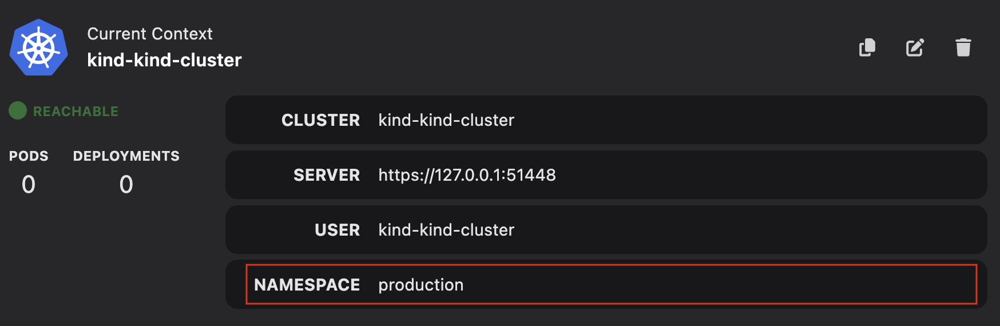

# Editing a Kubernetes context

You can edit a Kubernetes context to switch between different clusters and namespaces without any reconfigurations. Within kubernetes, defining or editing a context is useful to:

- Manage multiple development, testing, and production environments.
- Simplify your interaction when working with multiple clusters and namespaces.

#### Prerequisites

- [A running Podman machine](/docs/podman/creating-a-podman-machine).
- [A Kubernetes cluster](/docs/kubernetes/creating-a-kube-cluster).

#### Procedure

1. Go to the **Settings > Kubernetes** page.
1. Click the **Edit Context** icon. The Edit Context popup window opens.
   
1. Optional: Edit the name of the context.
1. Enter a namespace, such as testing or production, for the context.
   
1. Click **Save**.

#### Verification

- View the updated context details on the same page.
  
