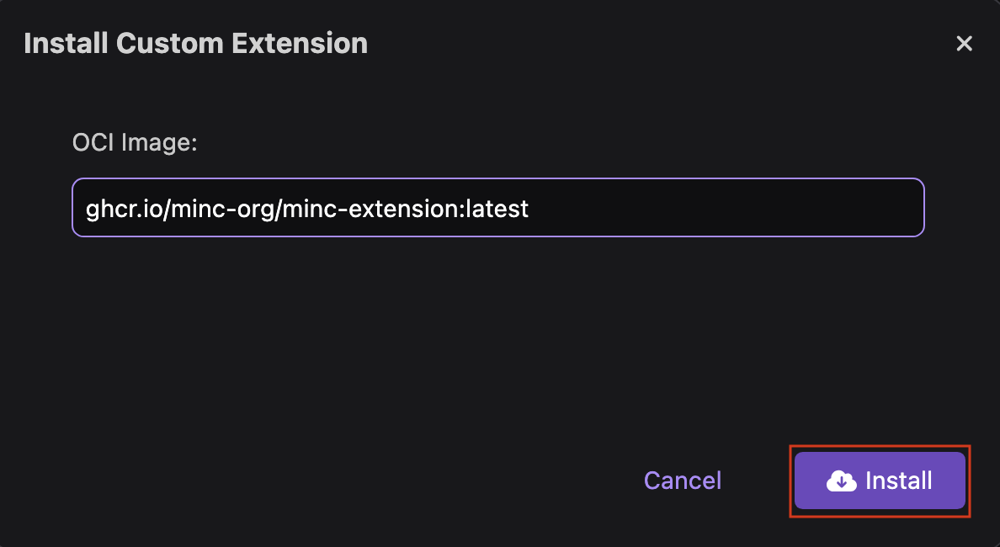
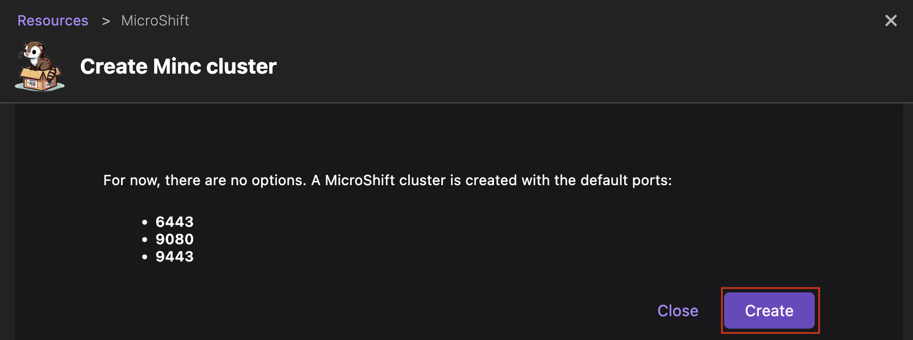

# Creating a MicroShift cluster

With Podman Desktop, you can use the MicroShift in a container (MINC) extension to create a lightweight Kubernetes cluster that runs on minimal resources, such as CPU, RAM, and storage. The cluster is deployed as a container within your Podman environment. After setting up a MicroShift cluster, you can:

- Develop Kubernetes applications in a resource-constrained environment.
- Provision lightweight Kubernetes control planes.
- Run your Kubernetes workloads at the edge or even in network-constrained situations, such as low connectivity or node access issues.
- Access the images built with Podman from your MicroShift cluster.
- Have a consistent development and management experience with an OpenShift Container Platform (OCP) cluster.

#### Prerequisites

- A running [Podman machine](/docs/podman/creating-a-podman-machine) with root privileges.

#### Procedure: Install the MINC extension

1. Click **Extensions** in the left navigation pane.
1. Click Install **custom...**.
1. Enter the OCI image name `ghcr.io/minc-org/minc-extension:latest`, and click **Install**.
   
1. Click **Done** after successfull installation.
1. Check that the MicroShift extension is available in the Installed tab.

#### Procedure: Create a MicroShift cluster

1. Go to **Settings > Resources**.
1. In the MicroShift tile, click the **Create new ...** button.
   
1. Click **Create**.
   
1. Optional: Click the **Show Logs** button to view the logs.
1. After successful creation, click the **Go back to resources** button.

#### Verification

- On the **Settings > Resources** page, your MicroShift instance is running.
  
- [Set your current context](/docs/kubernetes/viewing-and-selecting-current-kubernetes-context) to `microshift` for Kubernetes development.
- Run basic tasks, such as:
  - [Deploying a container](/docs/kubernetes/deploying-a-pod-to-kubernetes)
  - [Deploying a pod](/docs/kubernetes/deploying-a-pod-to-kubernetes)

#### Additional resources

- [minc-extension repository](https://github.com/minc-org/minc-extension)
